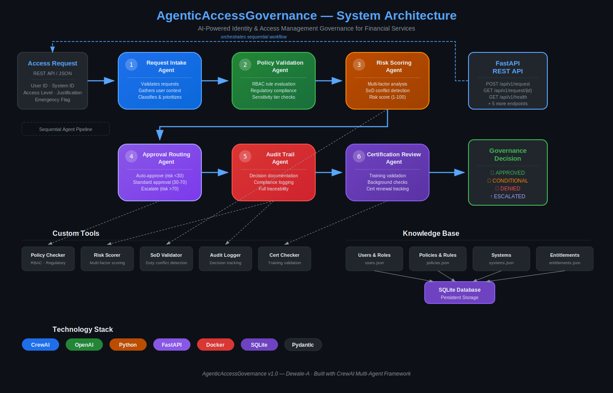

# Agentic Access Governance

An AI-powered Identity and Access Management (IAM) governance system designed specifically for financial services organizations. This system provides automated access request processing, policy validation, risk assessment, and regulatory compliance monitoring using intelligent agents powered by CrewAI.

## Overview

The AgenticAccessGovernance system streamlines and strengthens identity access management through a sophisticated multi-agent architecture that evaluates access requests against corporate policies, regulatory requirements, and risk parameters. Built for financial services institutions requiring stringent governance and audit trails.

## Key Features

### Automated Access Governance
- **Intelligent Request Processing**: AI agents handle intake, validation, and classification of access requests
- **Policy Compliance**: Automated checking against RBAC rules, departmental policies, and regulatory constraints
- **Risk Assessment**: Comprehensive risk scoring based on user profiles, system sensitivity, and access patterns
- **Approval Routing**: Intelligent routing to appropriate approvers based on risk levels and organizational policies

### Regulatory Compliance
- **Multi-Regulator Support**: Built-in compliance for OSFI, PIPEDA, SOX, IIROC, and SR 11-7 requirements
- **Certification Tracking**: Automated validation of required training certifications and background checks
- **Audit Trail**: Complete audit logging with detailed reasoning and decision traceability
- **Segregation of Duties**: Advanced SoD conflict detection and violation prevention

### Financial Services Focus
- **Role-Based Access Control**: Comprehensive RBAC implementation with financial services roles
- **Sensitive Data Protection**: Multi-tier sensitivity classification (Internal, Confidential, Restricted)
- **Cross-Department Controls**: Specialized policies for inter-departmental access requests
- **Emergency Access**: Controlled emergency access processes with immediate audit notifications

## Architecture



The system employs a multi-agent architecture with six specialized AI agents:

1. **Request Intake Agent** - Receives, validates, and classifies incoming access requests
2. **Policy Validation Agent** - Evaluates requests against RBAC rules, departmental policies, and regulatory constraints
3. **Risk Scoring Agent** - Assigns comprehensive risk scores based on multiple risk factors
4. **Approval Routing Agent** - Routes requests for approval based on risk assessment and organizational policies
5. **Audit Trail Agent** - Creates comprehensive audit logs with detailed decision reasoning
6. **Certification Review Agent** - Validates training certifications and compliance requirements

## Technology Stack

- **AI Framework**: CrewAI for multi-agent orchestration
- **Language Model**: OpenAI GPT-4 for intelligent decision making
- **API Framework**: FastAPI for RESTful services
- **Database**: SQLite with JSON seed data integration
- **Containerization**: Docker with docker-compose for easy deployment
- **Language**: Python 3.11+ with comprehensive type hints

## Quick Start

### Prerequisites
- Python 3.11 or higher
- Docker and Docker Compose
- OpenAI API key

### Installation

1. **Clone the repository**:
   ```bash
   git clone https://github.com/Dewale-A/AgenticAccessGovernance.git
   cd AgenticAccessGovernance
   ```

2. **Set up environment**:
   ```bash
   cp .env.example .env
   # Edit .env with your OpenAI API key and other configuration
   ```

3. **Install dependencies**:
   ```bash
   pip install poetry
   poetry install
   ```

4. **Run with Docker**:
   ```bash
   docker-compose up -d
   ```

### Testing the System

Run the test script to process a sample access request:

```bash
python run_test.py
```

This will process request REQ001 and demonstrate the complete governance workflow.

## API Endpoints

### Core Access Management
- `POST /api/v1/request` - Submit new access request
- `POST /api/v1/request/async` - Submit request for asynchronous processing
- `GET /api/v1/request/{request_id}` - Get request status and decision
- `GET /api/v1/health` - System health check

### User and Entitlement Management
- `GET /api/v1/users` - List all users
- `GET /api/v1/users/{user_id}/entitlements` - Get user's current entitlements
- `GET /api/v1/audit/{request_id}` - Get audit trail for request
- `POST /api/v1/certification/review` - Trigger certification review

## Configuration

Key configuration options in `.env`:

```env
# OpenAI Configuration
OPENAI_API_KEY=your_openai_api_key_here
OPENAI_MODEL=gpt-4

# Risk Thresholds
LOW_RISK_THRESHOLD=30
HIGH_RISK_THRESHOLD=70

# Compliance Settings
REGULATOR_VALIDATION=true
AUDIT_LEVEL=STRICT
EMERGENCY_ACCESS_ENABLED=true
```

## Data Models

The system uses comprehensive data models for:

- **Users**: Complete user profiles with roles, departments, and certification status
- **Access Requests**: Detailed request information with workflow status
- **Policies**: RBAC rules, SoD constraints, and regulatory requirements
- **Systems**: Enterprise resource definitions with sensitivity classifications
- **Audit Records**: Complete decision trails with reasoning and context

## Compliance and Security

### Regulatory Compliance
- **OSFI Guidelines**: Comprehensive risk management and governance controls
- **PIPEDA**: Privacy protection for personal information access
- **SOX**: Financial reporting system access controls
- **IIROC**: Investment industry regulatory compliance
- **SR 11-7**: Model risk management requirements

### Security Features
- **Multi-Factor Authentication**: Support for additional authentication factors
- **Session Management**: Secure session handling with timeout controls
- **Encryption**: Data encryption at rest and in transit
- **Access Logging**: Comprehensive access and decision logging

## Development

### Project Structure
```
AgenticAccessGovernance/
├── src/
│   ├── agents/          # AI agent definitions
│   ├── tasks/           # CrewAI task definitions
│   ├── models/          # Pydantic data models
│   ├── tools/           # Specialized AI tools
│   ├── api/             # FastAPI REST endpoints
│   ├── db/              # Database utilities
│   └── config/          # Configuration management
├── data/                # JSON seed data
├── tests/               # Test suite
├── docs/                # Documentation and diagrams
└── output/              # Generated outputs and logs
```

### Running Tests
```bash
poetry run pytest tests/
```

### Code Quality
The project uses comprehensive type hints, follows PEP 8 standards, and includes detailed docstrings for all components.

## Contributing

1. Fork the repository
2. Create a feature branch (`git checkout -b feature/amazing-feature`)
3. Commit your changes (`git commit -m 'Add amazing feature'`)
4. Push to the branch (`git push origin feature/amazing-feature`)
5. Open a Pull Request

## License

This project is licensed under the MIT License. See the LICENSE file for details.

## Support

For support and questions:
- Create an issue in this repository
- Review the documentation in the `/docs` directory
- Check the example usage in `run_test.py`

## Acknowledgments

- Built with CrewAI for multi-agent orchestration
- Powered by OpenAI's GPT-4 for intelligent decision making
- Designed for financial services governance requirements
- Inspired by industry best practices in identity and access management
